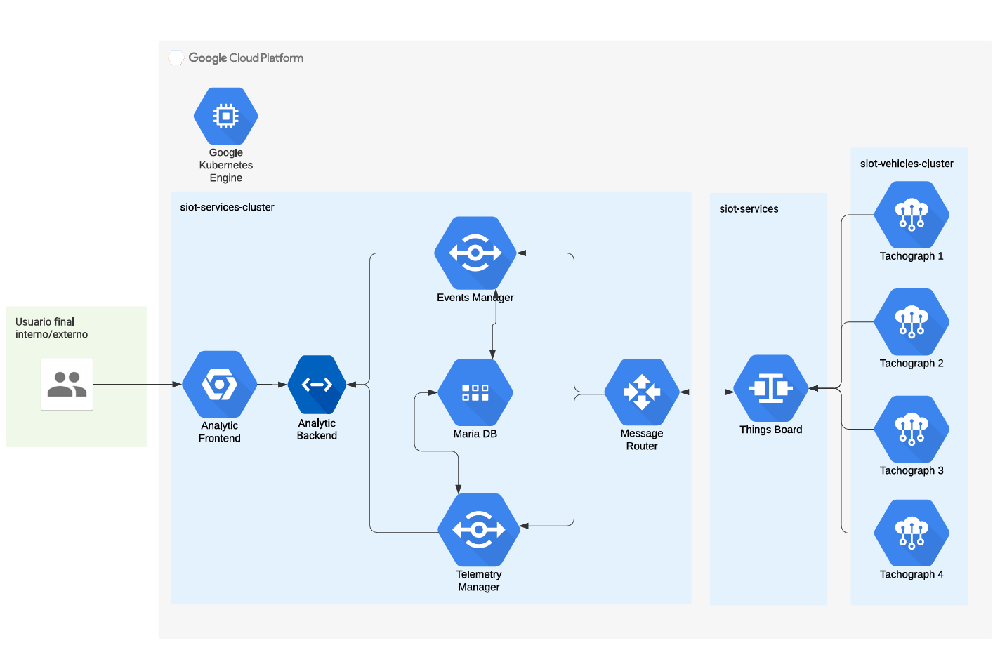

# k8s-iot-tachograph-digital-twin

This project simulates a scalable IoT digital tachograph system using Kubernetes and Docker, designed for deployment on Google Cloud Platform (GCP). It features a modular architecture for simulating vehicle tachographs, managing telemetry, and providing analytics through ThingsBoard and custom microservices.

## Architecture



### Main Components

- **Google Kubernetes Engine (GKE):** Orchestrates all services and simulators.
- **siot-services-cluster:** Hosts core backend, analytics, and data management services.
  - **Analytic Frontend & Backend:** Web application for end users with dashboards and analytics.
  - **Events Manager & Telemetry Manager:** Event processing and telemetry management.
  - **MariaDB:** Central database for storing telemetry and event data.
  - **Message Router:** Routes messages between services and ThingsBoard.
- **siot-vehicles-cluster:** Simulates multiple digital tachographs (virtual vehicles).
  - **Tachograph Simulators:** Each instance simulates a vehicle's tachograph, including subsystems for control, card reading, positioning, odometer, and route generation.
- **ThingsBoard:** IoT platform for device management, data visualization, and integration.

> **Note:** ThingsBoard must be deployed independently from the cluster. Once deployed, update its external IP address in the corresponding configmaps so that all services can communicate with it correctly.

## Directory Structure

- `siot-services/`  
  Backend services, analytics, message routing, database, and ThingsBoard integration.
- `VirtualTachograph/`  
  Digital tachograph simulator and its subsystems (ControlUnit, CardReader, PositioningSystem, Odometer, RoutesGenerator).
- `delete-all-pvc.sh`  
  Script to clean up Persistent Volume Claims in Kubernetes.
- `README.md`  
  Project documentation (this file).

## Deployment

### Local Deployment

Local deployment is intended to be run on Minikube using the provided scripts. **Docker Compose file is deprecated and should not be used for local development.**

- To launch the core services on Minikube:
  ```sh
  cd siot-services
  ./launch_services_local.sh
  ```
- To launch the virtual tachographs on Minikube:
  ```sh
  cd VirtualTachograph
  ./launch_tachographs_local.sh
  ```

### Cloud Deployment (GCP)

- Use the scripts `launch_services_gcp.sh` and `launch_tachographs_gcp.sh` to deploy the services and simulators to Google Kubernetes Engine.

## Usage

- Access the analytics frontend for dashboards and data visualization.
- Use ThingsBoard for device management and telemetry monitoring.
- The simulated tachographs send data through the message router to the backend and ThingsBoard.

## Requirements

- Docker & Docker Compose
- Kubernetes (for cloud deployment)
- Google Cloud SDK (for GKE)
- Python (for most microservices)

## License

[Specify your license here]
